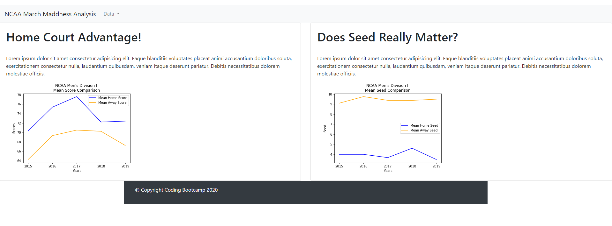
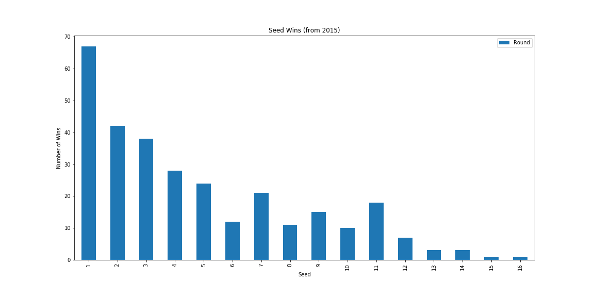
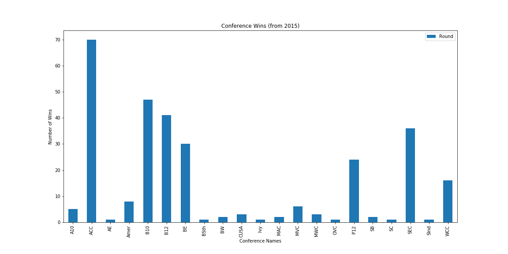

# March-Madness-ETLProject Title: Cash In On March Madness

## Team Members: Scott, Audelia, Kirkpatrick, Justin

## Project Description/Outline: 
Using data from the last five years of NCAA Basketball Tournament results, we will combine multiple datasets to build a database of 2015-2019 results including seed, conference, and regional data. With this database, we would be able for predictive analysis to determine the chance of success for a team based on their conference and tournament seeding. 

## Research Questions to Answer
Out of scope for this project 

## Datasets to Be Used
1. Kaggle - for conference data: https://www.kaggle.com/andrewsundberg/college-basketball-dataset
2. Data World - seeds, results from 2015-2019: https://data.world/michaelaroy/ncaa-tournament-results/workspace/file?filename=Big_Dance_CSV.csv

## Rough Breakdown of Tasks
Jupyter, postgres or sqllite, pandas, possibly sqlalchemy

1. In Jupyter, read in the data for both CSVs using pandas
2. CLean/fix/transform the data
3. Join the data sets
4. Save to SQL (postgres or sqllite)

